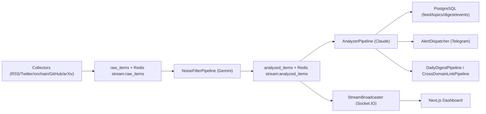

# Personal Intelligence Hub

실시간 멀티도메인 인텔리전스 시스템입니다.  
Crypto + AI/ML 신호를 수집하고, LLM 파이프라인으로 노이즈를 걸러 Action Signal로 변환한 뒤, 대시보드/다이제스트/알림으로 전달합니다.

## 이 프로젝트가 하는 일

- 멀티 소스 수집: RSS, on-chain(Whale Alert/Dune), GitHub, arXiv, 선택적 Twitter
- 2단계 LLM 분석:
  - 1차 `Noise Filter` (신호 여부, 중요도, 관련 토픽 분류)
  - 2차 `Analyzer` (감성 점수, 액션 시그널, 컨텍스트 요약)
- 실시간 피드 전달: Redis Stream -> Socket.IO `feed:item` 브로드캐스트
- 토픽 인텔리전스: 최근 24시간 토픽별 신호량/감성/대표 이벤트 제공
- Daily Digest: 토픽별 핵심 이벤트를 한국어 요약으로 생성
- KOL Heatmap: 도메인별 신뢰도 기반 모니터링 우선순위 제공

## 아키텍처 개요



## 기술 스택

- Backend: FastAPI, SQLAlchemy, Alembic, APScheduler, Redis Streams, Socket.IO
- Frontend: Next.js 14 (App Router), Tailwind CSS, Framer Motion, Socket.IO Client
- Data/Infra: PostgreSQL, Redis, Docker Compose
- LLM: Gemini (`gemini-2.0-flash`), Claude (`claude-3-5-sonnet-latest`)
- Test: Pytest, Playwright

## 프로젝트 구조

```text
.
├── backend
│   ├── alembic/                      # DB migration
│   ├── src/intel_hub
│   │   ├── api/                      # REST + websocket
│   │   ├── collectors/               # 외부 소스 수집기
│   │   ├── pipeline/                 # noise/analyzer/digest/cross-domain
│   │   ├── db/                       # ORM models + repository + seed
│   │   ├── services/                 # processing, broadcaster, alert
│   │   ├── scheduler.py              # 수집/다이제스트 스케줄링
│   │   └── worker.py                 # 백그라운드 파이프라인 루프
│   └── tests/                        # pytest
├── frontend
│   ├── src/app/                      # Next.js routes
│   ├── src/components/               # UI + animation
│   ├── src/lib/                      # API client + socket client + mock
│   └── tests/                        # Playwright regression specs
└── docker-compose.yml                # local postgres/redis
```

## 빠른 시작

### 1) 사전 요구사항

- Python 3.12+
- `uv`
- Node.js 20+ + `pnpm`
- Docker / Docker Compose

### 2) 환경 변수 준비

```bash
cp .env.example .env
```

기본 `.env.example`에는 로컬 플레이스홀더가 포함되어 있습니다.  
실데이터/실분석을 원하면 아래 키를 실제 값으로 교체하세요.

### 3) 인프라 실행 (PostgreSQL, Redis)

```bash
docker compose up -d
```

### 4) Backend 실행

```bash
cd backend
uv sync
uv run alembic upgrade head
uv run python -m intel_hub.db.seed
uv run uvicorn intel_hub.api.main:socket_app --reload --host 0.0.0.0 --port 8000
```

별도 터미널에서 Worker 실행:

```bash
cd backend
uv run python -m intel_hub.worker
```

### 5) Frontend 실행

```bash
cd frontend
pnpm install
pnpm dev
```

- Frontend: [http://localhost:3000](http://localhost:3000)
- Backend Docs (Swagger): [http://localhost:8000/docs](http://localhost:8000/docs)

## 핵심 API

Base URL: `http://localhost:8000/api/v1`

| Endpoint | 설명 |
|---|---|
| `GET /domains` | 활성 도메인 목록 + 토픽 + 액션시그널 메타 |
| `GET /feed?domain=all\|crypto\|ai_ml&limit=50&min_importance=1` | 중요도 기반 통합/도메인 피드 |
| `GET /topics/{domain_id}` | 24시간 토픽 통계(신호량, 평균 감성, top items) |
| `GET /digest?domain=crypto\|ai_ml&digest_date=YYYY-MM-DD` | 일일 다이제스트 |
| `GET /kols?domain=all\|crypto\|ai_ml` | KOL 신뢰도 목록 |
| `GET /events?domain=all\|crypto\|ai_ml&limit=20` | 이벤트 캘린더용 상위 이벤트 |

Socket.IO namespace: `/feed`  
이벤트: `feed:item`, `feed:heartbeat`

## 프론트엔드 화면

| Route | 설명 |
|---|---|
| `/` | 전체 멀티도메인 피드 + 토픽 인텔리전스 + 이벤트 캘린더 |
| `/domain/crypto` | Crypto 도메인 전용 피드 |
| `/domain/ai_ml` | AI/ML 도메인 전용 피드 |
| `/topic/[domain]/[slug]` | 토픽 상세 + 관련 피드 |
| `/digest` | 도메인별 일일 다이제스트 |
| `/kols` | KOL Heatmap |

## 스케줄러 동작 (Worker)

기본 타임존은 `APP_TIMEZONE` (기본 `Asia/Seoul`) 입니다.

| Job | 주기 | 내용 |
|---|---|---|
| Realtime collectors | 5분 | `RSS`, `Onchain` (+ Twitter 옵션) 수집 |
| AI/ML GitHub collectors | 6시간 | AI/ML 오픈소스 저장소 변화 수집 |
| AI/ML arXiv collectors | 매일 `daily_digest_hour_kst`시 | 최신 논문 수집 |
| Cross-domain linking | 30분 | 도메인 간 연관 이벤트 연결 생성 |
| Daily digest | 매일 `daily_digest_hour_kst`시 | 토픽별 요약 생성 |

실시간 처리 루프는 Worker에서 약 2초 간격으로 Redis Stream을 소비합니다.

## 테스트

### Backend

```bash
cd backend
uv run pytest
```

### Frontend (Playwright)

```bash
cd frontend
pnpm test:e2e:ux
pnpm test:e2e:notice
pnpm test:e2e:mobile
```

참고: Playwright는 `NEXT_PUBLIC_USE_MOCK=true`로 dev server를 자동 실행해 회귀 검증합니다.

## 환경 변수 가이드

| 변수 | 용도 | 비고 |
|---|---|---|
| `DATABASE_URL` | PostgreSQL 연결 | 필수 |
| `REDIS_URL` | Redis 연결 | 필수 |
| `ANTHROPIC_API_KEY` | Analyzer, Daily Digest | 실행시 필수 체크 |
| `GOOGLE_AI_API_KEY` | Noise Filter | 실행시 필수 체크 |
| `SUPABASE_URL`, `SUPABASE_KEY` | 확장 연동용 | 현재도 실행시 필수 체크 |
| `TELEGRAM_BOT_TOKEN` | 알림 전송/봇 | 실행시 필수 체크 |
| `ENABLE_TWITTER_SOURCE` | Twitter 수집 on/off | `true`면 `TWITTER_BEARER_TOKEN` 필요 |
| `GITHUB_TOKEN` | GitHub API rate-limit 완화 | 선택 |
| `WHALE_ALERT_API_KEY`, `DUNE_API_KEY` | 온체인 수집 | 선택(없으면 해당 수집 비활성) |
| `NEXT_PUBLIC_API_BASE_URL` | FE -> BE API 주소 | 프론트 설정 |
| `NEXT_PUBLIC_SOCKET_BASE_URL`, `NEXT_PUBLIC_SOCKET_NAMESPACE` | 실시간 소켓 설정 | 프론트 설정 |
| `NEXT_PUBLIC_USE_MOCK` | API 실패/개발시 모의데이터 사용 | Playwright에서 활용 |

## 운영 메모 (MVP)

- 외부 API 호출 실패 시 수집/분석 파이프라인은 로그를 남기고 다음 작업으로 진행합니다.
- 일부 키가 유효하지 않으면 분석 결과가 축소되거나 파싱 fallback 결과(`parser_error`)가 저장될 수 있습니다.
- Frontend API 요청 실패 시 `src/lib/mock.ts` 데이터로 자동 폴백됩니다.

---

문서 기준으로 바로 실행했을 때 추천 확인 순서:

1. `/docs`에서 API 응답 확인
2. `/`에서 피드/토픽/이벤트 렌더 확인
3. Worker 로그에서 수집 -> 분석 -> 브로드캐스트 흐름 확인
